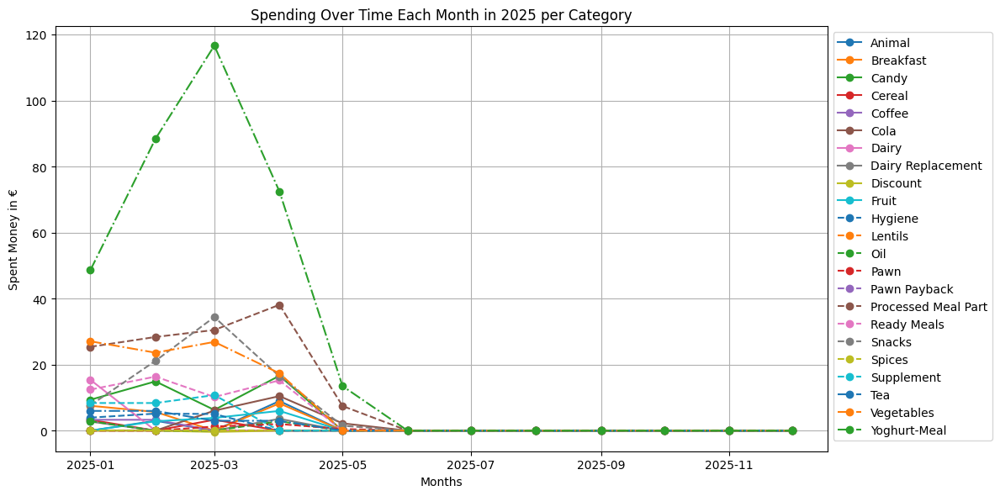
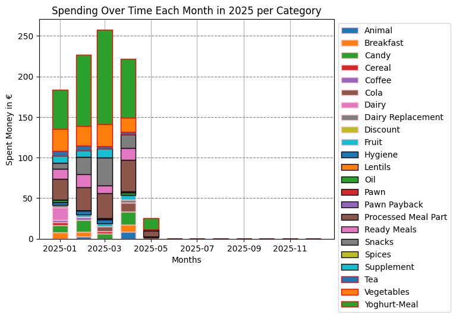
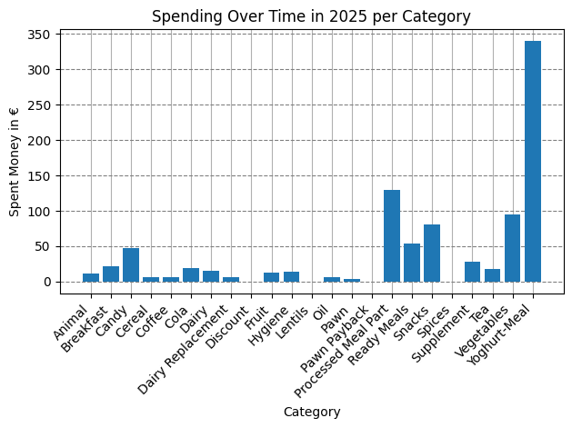

# SupermarketClarity
Goal of this project is to bring you clarity regarding how much money you spent in your different supermarkets and what kind of food you buy.

For example you may detect that you spend a lot of money on candy and can see your progress in change over the months to eat more fruits.

To achieve that these Python scripts extract bought items from a PDF file receipt (which many supermarkets offer nowadays, like REWE) and create graphs from this data in the end.

Take a look at the [graphs](#graphs) at the end of this file or at the data and graphs within the '[Example](Example)' directory.

If you want to know whether you market is already support check out [Supported Markets](#supported-markets). If yours to be added, add an issue with information as mentioned in [What data is required for bugs](#what-data-is-required-for-bugs).

### Outline
+ [Requirements](#requirements)
+ [How to use it](#how-to-use-it)
    + [EXECUTE_ME.py](#execute_mepy)
    + [CLEAN_UP.py](#clean_uppy)
+ [How it works](#how-it-works)
+ [Things that don't work yet](#things-that-dont-work-yet)
+ [Supported Markets](#supported-markets)
+ [What data is required for bugs?](#what-data-is-required-for-bugs)
+ [Last Notes](#last-notes)
+ [Graphs](#graphs)

## Requirements
This code has been created with Python 3.12. To install it and manage its environment I use [Conda](https://www.anaconda.com/download/success).

Once your Python is setup you only need to install [Pandas](https://pandas.pydata.org/docs/getting_started/install.html) via ``pip install pandas``. It contains the dependency of [matplotlib](https://matplotlib.org).

If you require the support of PNGs you need to install [Tesseract-OCR](https://github.com/tesseract-ocr/tesseract?tab=readme-ov-file#installing-tesseract) and the python wrapper for it [TesserOCR](https://github.com/sirfz/tesserocr) via ``pip install tesserocr``.  If you install "Tesseract-OCR" not via Homebrew on MacOS you may need to adapt the path of the variable ``tesseract_training_data`` in [script_value.py](/Scripts/script_values.py) file.

If you want to get the dayplots like in this [example](Example/Graphs/REWE/Over_Years_per_category_Spent_per_Category_per_Year.csv.png) you need to install [Dayplot](https://josephbarbierdarnal.github.io/dayplot/) via ``pip install dayplot``.

Alternatively, use the [requirements.txt](requirements.txt) file for installation and overview of all packages.

## How to use it
There are only two scripts for you two execute.

We assume that you run the scripts from the repository main directory, not your home directory.

### EXECUTE_ME.py
This file can be run as it is but also takes either one parameter, the market, two parameters, market and year, or three parameters, market, year and category.

**No parameters**

``python3.12 EXECUTE_ME.py``

**Parameter market**

``python3.12 EXECUTE_ME.py REWE``

**Parameter market and year**

``python3.12 EXECUTE_ME.py REWE 2025``

**Parameter market, year and category**

``python3.12 EXECUTE_ME.py REWE 2025 candy``

In general the script checks that you provide a valid year and market name. If you provide no year, the current year will be assumed. If you provide no market, it will throw an error.

In general the command line tells you in the response if something is missing.

IMPORTANT: Your receipts are expected to be in ['Your Receipts'](Your%20Receipts) directory or a subdirectory created by running the command with the market parameter at least once.

IMPORTANT: After the first run a file called *``<Your Market>_complete_items_categories.csv``* will be created in the directory *``Data/CSV Results/<Your Market>``*. This file will be the key to match your bought items with categories.

At the beginning your will need to fill this list once. Every item that is not known and new will be mapped to the category *Unknown*.

To see an example for how this can look like see [here](Example/Data/CSV%20Results/REWE/REWE_complete_items_categories.csv).

### CLEAN_UP.py
Sometimes you may want to cleanup your mess. This script helps you with this. It can remove the files for a market created by the EXECUTE_ME.py script. However, since the "market_complete_items_categories" file contains a lot of info created by manual mapping, this one gets moved and saved into the main directory, with timestamp in format "%Y-%m-%d_%H:%M:%S" attached so that no overwriting of previous mappings happen.

**Parameter market**

``python3.12 CLEAN_UP.py REWE``

The script will ask you for confirmation before execution and show you everything it has deleted afterwards.

## How it works
The script is based on 8 different steps.

1. Extracting the bought items from the PDF/PNG receipt files into CSV files. Check if your supermarket is already [supported](#supported-markets). If the design of these files is different in other countries or for other supermarkets this piece of code requires the most adaptation.
2. Merge all the CSVs into one file for further processing. This file will always ordered by date from oldest to newsest so that new purchases can be seen at the end. For the example look [here](Example/Data/CSV%20Results/REWE/2025_merged_receipts.csv).
3. This part goes through the merged receipts file and checks every item. If it is not yet known, it gets added to a list. This creates this file [here](Example/Data/CSV%20Results/REWE/2025_unique_items.csv).
4. Now we take the unique items and try to match them with the data from the ["complete_items_categories"](Example/Data/CSV%20Results/REWE/REWE_complete_items_categories.csv) file. Every item that is not known yet will be matched with the catergory "Unknown". The result will be saved in ["\<year>_unique_items_and_categories"](Example/Data/CSV%20Results/REWE/2025_unique_items_and_categories_merged.csv)
5. Since we may work with multiple years and bought different items over the years this step merges the previously created file in step 4 together to our known file ["complete_items_categories"](Example/Data/CSV%20Results/REWE/REWE_complete_items_categories.csv). Additionally we extract the ["unique_categories"](Example/Data/CSV%20Results/REWE/REWE_unique_categories.csv) file.
6. In this step, we create the [big enriched receipt file](Example/Data/CSV%20Results/REWE/2025_enriched_receipts.csv). After all the extraction of unique items and mapping them with categories, we can finally add the information of the category to the original long receipt file.
7. Now, we use the enriched receipt file and transform the data in such ways that they can be used for graphic display as seen in section [Graphs](#graphs). The data that is calculated through different means, can be seen [here](Example/Data/CSV%20Results/For%20graphs/REWE/).
8. Finally, we use the libraries "Pandas" and "matplotlib" to read in the CSVs for the graphs and create them. How they look like you can see in section [Graphs](#graphs)

## Things that don't work yet
+ Currently, data samples are limited, especially for edge cases like cancellation or usage of coupons and so on.
+ It is currently based on German language. This means some trigger words would need adaptation for internationalization or even different markets.

## Supported Markets
[German food retail markets](https://de.wikipedia.org/wiki/Liste_von_Lebensmitteleinzelhändlern) based on Wikipedia.

NA stands for "not available" in the following tables. 

Markets that only offer a PNG as receipt can be faulty since OCR doesn't work always 100% correct.

This tables was updated the last time at 18.05.2025.
| Markets | eReceipts | eReceipts also online available| PDF or PNG| online receipts | pawns | discount| weighted items| meat counter| Cancellation |
|-----  |:---:|:--:|:---:|:--:|:--:|:-:|:--:|:--:|:-:|
| REWE |    ✅ | ✅ | PDF |  | ✅ | ✅ | ✅ | ✅ |  |
| EDEKA |   ✅ | ❌ | PDF |  | ✅ | ✅ |  | |  |
| DM |      ✅ | ✅ | PDF |   | NA | ✅ | NA | NA | ✅ |
| Aldi Sued|❌ | |     |   |    |    |   |     |    |
| Aldi Nord|❌ | |     |   |    |    |   |     |    |
| LIDL |    ✅ | ✅ | PNG| | | |✅ | | |
| Kaufland| ✅ |❌ |PDF| |✅| ✅|✅ | | |
| PENNY |   ❌ | NA | | | | | | | |
| NETTO |   ✅ to get| to check | to check | | | | | | |
| GLOBUS |  ❌ | | | | | | | |
| TEGUT |   ❌ | | | | | | | |
| NORMA |   ❌ | | | | | | | |
| Nahkauf | ❌ | | | | | | | |
| Alnatura| ❌ | | | | | | | |

German non-food retail market. Based on receipts I got, no complete list. More used to detect patterns in receipts.
| Markets | eReceipts |  eReceipt also online available| PDF or PNG| online receipts | pawns | discount| weighted items| meat counter| Cancellation
|-----|:-----:|:----:|:---:|:---:|:---:|:---:|:-:|:-:|:-:|
| MÜLLER|   ✅ | to check| PNG |
| ROSSMANN| 
| OBI |     ✅ | to check | PDF|  |  |  | ✅ | 

## What data is required for bugs?
Best things to provide to me is to explain the context in which your error appeared. If possible providing information about market name and how many items were bought during one purchase can help. Also, whether you bought something special that requires additional weighting like food from the meat counter or unpacked vegetables and fruits.

If possible a screenshot of the important part of your receipt can also help. I don't want to know your explicit market. Privacy and so. :)

At least this is the data for bugs caused by edge cases. To integrate a new whole market, at least two receipts with a lot of items are very useful.

## Last notes
Feel encourage to fork the project and adapt it to your own needs. Also, I am curious about additional features or ideas to create more interesting graphs in the end or maybe add a graphic interface to improve the user experience?

## Graphs

